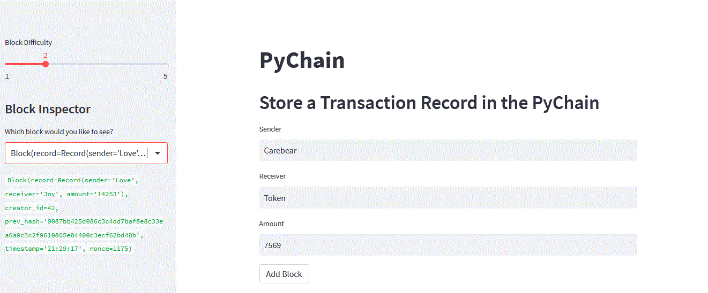

# Homework #18: PyChain Ledger
### By: Yen

PyChain.py is a basic blockchain ledger. It tracks transaction from sender to receiver, amount and timestamp. 
Below is the example of the blockchain:

First Block

Second Block

Third Block

Forth Block

Validate the Block

